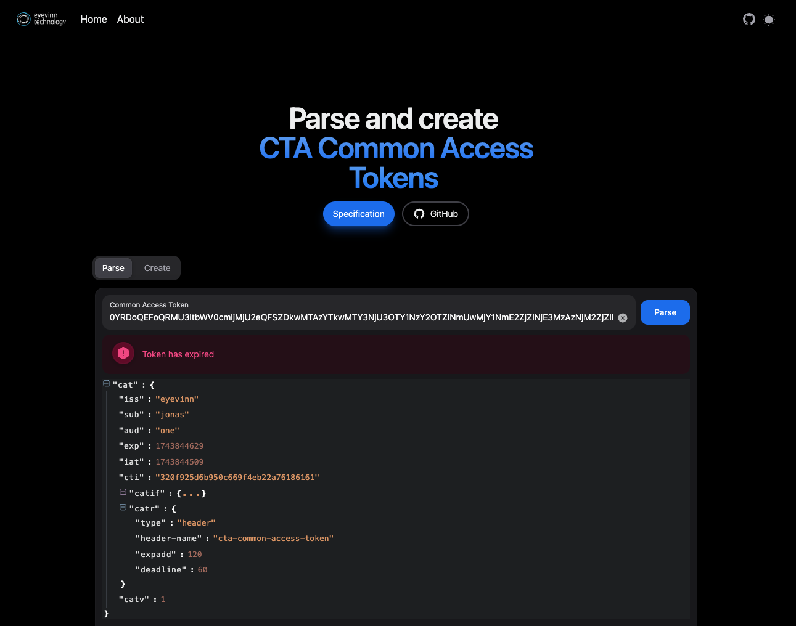

<h1 align="center">
  Node library for Common Access Token
</h1>

<div align="center">
  Node library for Common Access Token (CTA-5007)
  <br />
  <br />
  :book: <b><a href="https://eyevinn.github.io/node-cat/">SDK Documentation</a></b> :eyes:
  <br />  
</div>

<div align="center">
<br />

[](https://www.npmjs.com/package/@eyevinn/cat)
[](https://github.com/Eyevinn/node-cat/releases)
[](LICENSE)

[](https://github.com/eyevinn/node-cat/issues?q=is%3Aissue+is%3Aopen+label%3A%22help+wanted%22)
[](https://github.com/eyevinn)
[](http://slack.streamingtech.se)

</div>

This is a Node library for generating and validating Common Access Tokens (CTA-5007).

Online token parser and generator available at [cta-token.net](https://cta-token.net)



Features:

- Generate and Validate Common Access Tokens. Supported claims in table below.
- HTTP and CloudFront Lambda handlers supporting
  - Validation and parsing of tokens
  - Handle automatic renewal of tokens
  - Token usage count using store plugins (see further down for available plugins)
  - Log how tokens are being used with logging plugins (see further down for available plugins)

Following projects (known to the maintainer) are using this library:

- [CAT Validator service](https://github.com/Eyevinn/cat-validate) by Eyevinn

Want your name on this list? Submit a PR or create an issue.

## Claims Validation Support

### Core Claims

| Claim                                                     | Pass-through | Validate |
| --------------------------------------------------------- | ------------ | -------- |
| Issuer (`iss`)                                            | Yes          | Yes      |
| Audience (`aud`)                                          | Yes          | Yes      |
| Expiration (`exp`)                                        | Yes          | Yes      |
| Not Before (`nbf`)                                        | Yes          | Yes      |
| CWT ID (`cti`)                                            | Yes          | Yes      |
| Subject (`sub`)                                           | Yes          | n/a      |
| Issued at (`iat`)                                         | Yes          | n/a      |
| Common Access Token Replay (`catreplay`)                  | Yes          | Yes      |
| Common Access Token Probability of Rejection (`catpor`)   | Yes          | No       |
| Common Access Token Version (`catv`)                      | Yes          | Yes      |
| Common Access Token Network IP (`catnip`)                 | Yes          | No       |
| Common Access Token URI (`catu`)                          | Yes          | Yes      |
| Common Access Token Methods (`catm`)                      | Yes          | Yes      |
| Common Access Token ALPN (`catalpn`)                      | No           | No       |
| Common Access Token Header (`cath`)                       | Yes          | No       |
| Common Access Token Geographic ISO3166 (`catgeoiso3166`)  | Yes          | No       |
| Common Access Token Geographic Coordinate (`catgeocoord`) | Yes          | No       |
| Geohash (`geohash`)                                       | Yes          | No       |
| Common Access Token Altitude (`catgeoalt`)                | Yes          | No       |
| Common Access Token TLS Public Key (`cattpk`)             | Yes          | No       |
| Common Access Token If (`catif`) claim                    | Yes          | Yes      |
| Common Access Token Renewal (`catr`) claim                | Yes          | No       |

## Requirements

- Node version 22+

## Installation / Usage

```bash
% npm install --save @eyevinn/cat
```

### Validate CTA Common Access Token in HTTP incoming message

```javascript
import { HttpValidator, RedisCTIStore } from '@eyevinn/cat';

const httpValidator = new HttpValidator({
  keys: [
    {
      kid: 'Symmetric256',
      key: Buffer.from(
        '403697de87af64611c1d32a05dab0fe1fcb715a86ab435f1ec99192d79569388',
        'hex'
      )
    }
  ],
  autoRenewEnabled: true // Token renewal enabled. Optional (default: true)
  tokenMandatory: true // Optional (default: true)
  issuer: 'eyevinn',
  audience: ['one', 'two'], // Optional
  store: new RedisCTIStore(new URL(process.env.REDIS_URL || 'redis://localhost:6379')), // Where to store token usage count. Optional (default: none)
  logger: new ConsoleLogger() // Adapter to store all tokens that been successfully validated. Optional (default: none)
});

const server = http.createServer((req, res) => {
  const result = await httpValidator.validateHttpRequest(
    req, res
  );
  console.log(result.claims); // Claims
  console.log(res.getHeaders('cta-common-access-token')); // Renewed token
  console.log(result.count); // Number of times the token has been used
  res.writeHead(result.status, { 'Content-Type': 'text/plain' });
  res.end(result.message || 'ok');
});
server.listen(8080, '127.0.0.1', () => {
  console.log('Server listening');
});
```

```bash
% curl -v -H 'CTA-Common-Access-Token: 2D3RhEOhAQWhBFBha2FtYWlfa2V5X2hzMjU2U6MEGmfXP_YGGmfXQAsFGmfXQAtYINTT_KlOyhaV6NaSxFXkqJWfBagSkPkem10dysoA-C0w' http://localhost:8080/
> GET / HTTP/1.1
> Host: localhost:8080
> User-Agent: curl/8.7.1
> Accept: */*
> CTA-Common-Access-Token: 2D3RhEOhAQWhBFBha2FtYWlfa2V5X2hzMjU2U6MEGmfXP_YGGmfXQAsFGmfXQAtYINTT_KlOyhaV6NaSxFXkqJWfBagSkPkem10dysoA-C0w
>
* Request completely sent off
< HTTP/1.1 401 Unauthorized
< Content-Type: text/plain
< Date: Sun, 16 Mar 2025 23:11:03 GMT
< Connection: keep-alive
< Keep-Alive: timeout=5
< Transfer-Encoding: chunked
<
* Connection #0 to host localhost left intact
Token has expired
```

### Validate CTA Common Access Token in a CloudFront request

```javascript
import {
  Context,
  CloudFrontResponseEvent,
  CloudFrontResponseCallback
} from 'aws-lambda';
import { HttpValidator } from '@eyevinn/cat';

export const handler = async (
  event: CloudFrontResponseEvent,
  context: Context,
  callback: CloudFrontResponseCallback
) => {
  const httpValidator = new HttpValidator({
    keys: [
      {
        kid: 'Symmetric256',
        key: Buffer.from(
          '403697de87af64611c1d32a05dab0fe1fcb715a86ab435f1ec99192d79569388',
          'hex'
        )
      }
    ],
    issuer: 'eyevinn'
  });
  const request = event.Records[0].cf.request;
  const response = event.Records[0].cf.response;
  const result = await httpValidator.validateCloudFrontRequest(request);
  // If renewed new token is found here given catr type is "header"
  console.log(result.cfResponse.headers['cta-common-access-token']);
  console.log(result.count); // Number of times the token has been used (undefined if no store is enabled)
  response = result.cfResponse;
  if (result.claims) {
    console.log(result.claims);
  }
  callback(null, response);
};
```

### Verify token

```javascript
import { CAT } from '@eyevinn/cat';

const validator = new CAT({
  keys: {
    Symmetric256: Buffer.from(
      '403697de87af64611c1d32a05dab0fe1fcb715a86ab435f1ec99192d79569388',
      'hex'
    )
  }
});
const base64encoded =
  '0YRDoQEEoQRMU3ltbWV0cmljMjU2eKZkOTAxMDNhNzAxNzU2MzZmNjE3MDNhMmYyZjYxNzMyZTY1Nzg2MTZkNzA2YzY1MmU2MzZmNmQwMjY1NmE2ZjZlNjE3MzAzNzgxODYzNmY2MTcwM2EyZjJmNmM2OTY3Njg3NDJlNjU3ODYxNmQ3MDZjNjUyZTYzNmY2ZDA0MWE1NjEyYWViMDA1MWE1NjEwZDlmMDA2MWE1NjEwZDlmMDA3NDIwYjcxSKuCk/+kFmlY';
try {
  const result = await validator.validate(base64encoded, 'mac', {
    issuer: 'coap://as.example.com'
  });
  if (result.error) {
    console.log(result.error.message);
  }
  console.log(result.cat?.claims);
} catch (err) {
  // Not valid
  console.log(err);
}
```

### Generate token

```javascript
import { CAT } from '@eyevinn/cat';

const generator = new CAT({
  keys: {
    Symmetric256: Buffer.from(
      '403697de87af64611c1d32a05dab0fe1fcb715a86ab435f1ec99192d79569388',
      'hex'
    )
  }
});
const base64encoded = await generator.generateFromJson(
  {
    iss: 'coap://as.example.com',
    sub: 'jonas',
    aud: 'coap://light.example.com',
    exp: 1444064944,
    nbf: 1443944944,
    iat: 1443944944,
    catr: {
      type: 'header',
      'header-name': 'cta-common-access-token',
      expadd: 120,
      deadline: 60
    }
  },
  {
    type: 'mac',
    alg: 'HS256',
    kid: 'Symmetric256',
    generateCwtId: true // automatically generate a random CWT Id (cti) claim (default: false)
  }
);
```

This example generates a token with a `catif` claim.

```javascript
import { CAT } from '@eyevinn/cat';

const generator = new CAT({
  keys: {
    Symmetric256: Buffer.from(
      '403697de87af64611c1d32a05dab0fe1fcb715a86ab435f1ec99192d79569388',
      'hex'
    )
  }
});

const json = {
  iss: 'eyevinn',
  exp: Math.floor(Date.now() / 1000) - 60,
  cti: 'foobar',
  catif: {
    exp: [
      307,
      {
        Location: [
          'https://auth.example.net/?CAT=',
          {
            iss: null,
            iat: null,
            catu: {
              host: { 'exact-match': 'auth.example.net' }
            }
          }
        ]
      },
      'Symmetric256'
    ]
  }
};
const base64encoded = await generator.generateFromJson(json, {
  type: 'mac',
  alg: 'HS256',
  kid: 'Symmetric256',
  generateCwtId: true
});
```

Providing above token to the `HttpValidator` the validator will return with a status code `307` and the header `Location` with the value of `https://auth.example.net/?CAT=<newtoken>` where `<newtoken>` is created by the JSON specified in the `catif` claim.

## Token store plugins

To enable token usage count the HTTP validators requires a way to store the token id:s that has been used. The following types of stores are supported today.

### Memory Store

```javascript
import { MemoryCTIStore } from '@eyevinn/cat';
const store = new MemoryCTIStore();
```

### Redis Store

```javascript
import { RedisCTIStore } from '@eyevinn/cat';
const store = new RedisCTIStore('redis://localhost:6379');
```

### Custom Store

To implement your own store you implement the interface `ICTIStore`, for example:

```javascript
import { ICTIStore, CommonAccessToken } from '@eyvinn/cat';

class MyStore implements ICTIStore {
  async storeToken(token: CommonAccessToken): Promise<number> {
    const cti = token.cti;
    // Store CTI in your key/value store and return new count
  }

  async getTokenCount(token: CommonAccessToken): Promise<number> {
    const cti = token.cti;
    // Return current token count for a CTI
  }
}
```

## Token logging plugin

Log how tokens are being used to be able to analyze detect usage anamolies with a token logging plugin. The following logging plugins are provided today.

### Console Logger

This just logs the token to stdout in a JSON format.

```javascript
import { ConsoleLogger } from '@eyevinn/cat';
const logging = new ConsoleLogger();
// Will output for example
// {"cti":"b43c9cef64ca7dc83af8a33f39fc7168","timestamp":1742386792234,"iat":1742386782,"exp":1742386902,"sub":"jonas"}
// {"cti":"b43c9cef64ca7dc83af8a33f39fc7168","timestamp":1742386799501,"iat":1742386782,"exp":1742386902,"sub":"jonas"}
```

### Custom Logger

To implement your own logger you implement the interface `ITokenLogger`, for example:

```javascript
import { ITokenLogger, CommonAccessToken } from '@eyvinn/cat';

// Pseudo code below
class MyLogger implements ITokenLogger {
  async logToken(token: CommonAccessToken): Promise<void> {
    if (!this.db.connected) {
      await this.db.connect();
    }
    this.db.insert(token);
  }
}
```

## Token Reuse Detection

Enforcing and detecting invalid token reuse when `catreplay` claim has a value of 2 is an implementation-defined process.

You provide a custom callback function to the HTTP validator. This callback is provided with the Common Access Token, store and logger. Pseudo code as an example.

```javascript
class MyLogger implements ITokenLogger {
  async logToken(token: CommonAccessToken): Promise<void> {
    if (!this.db.connected) {
      await this.db.connect();
    }
    this.db.insert(token);
  }
  async getLogsForToken(token: CommonAccessToken): Promise<LogList[]> {
    return await this.db.find({ cti: token.cti });
  }
}

const reuseDetection = async (
  cat: CommonAccessToken,
  store?: ICTIStore,
  logger?: ITokenLogger
) => {
  if (logger) {
    const logs = await logger.getLogsForToken(cat);
    return tokenLogsInPeriod(logs, 5) > 10; // two many uses within a 5 second period
  }
}

const httpValidator = new HttpValidator({
  keys: [
    {
      kid: 'Symmetric256',
      key: Buffer.from(
        '403697de87af64611c1d32a05dab0fe1fcb715a86ab435f1ec99192d79569388',
        'hex'
      )
    }
  ],
  issuer: 'eyevinn',
  logger: new MyLogger(),
  reuseDetection
});
...
```

## Development

<!--Add clear instructions on how to start development of the project here -->

## Contributing

See [CONTRIBUTING](CONTRIBUTING.md)

## License

This project is licensed under the MIT License, see [LICENSE](LICENSE).

# Support

Join our [community on Slack](http://slack.streamingtech.se) where you can post any questions regarding any of our open source projects. Eyevinn's consulting business can also offer you:

- Further development of this component
- Customization and integration of this component into your platform
- Support and maintenance agreement

Contact [sales@eyevinn.se](mailto:sales@eyevinn.se) if you are interested.

# About Eyevinn Technology

[Eyevinn Technology](https://www.eyevinntechnology.se) is an independent consultant firm specialized in video and streaming. Independent in a way that we are not commercially tied to any platform or technology vendor. As our way to innovate and push the industry forward we develop proof-of-concepts and tools. The things we learn and the code we write we share with the industry in [blogs](https://dev.to/video) and by open sourcing the code we have written.

Want to know more about Eyevinn and how it is to work here. Contact us at work@eyevinn.se!
